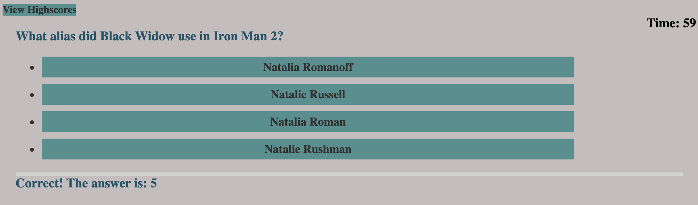

# Creating a Coding Quiz

## 1.Introduction

## 2.Goals

## 3.Reflection

## 4.Images of Live Web Page

## 5.Link to the Website

## 6.Credits

### 1. Introduction

The goal of this project was to simulate a coding assessment quiz. Often, assessments test the knowledge of potential applicants. For my quiz I chose a 10 multiple question test focus the first 10 questions on JavaScript. For fun, I did an additional 10 questions related to the Marvel Cinematic Universe. Coding is fun and I wanted to let a little of my personality come out in my work.

### 2. Goals

My goal when making this test was to ask questions that the typical coder should know. In order to make this test, I created index.html page to house the questions on the test. I also created a highscore.html page to score the high scores on local storage within the website. I chose to border the questions and answers in a crimson and white color scheme that was appealing to me. When creating my logic.js page I first created an array of 20 questions that I will be pulling my questions, choices and answers from. In the quiz I have given the test taker 10 seconds per question for a total of 200 seconds. If a question is answered incorrectly a penalty of 10 seconds will be deducted from the test takers time alotment. In order to display these questions sequentially and have a web page that changes with every answer I used jquery queryselector to connect in the document with the id tags in the html document. When a person is finished with the test the number of seconds remaining will be their total score. I was able to accomplish each of these goals. The user is able to input their initials after they take the quiz and then they are taken to the highscore.html page. This information is stored in local storage allowing the user to see how they did compared to other quiz takers.a

### 3. Reflection

As a junior web developer I found this task to be extremely challenging. I learned a great deal due to white boarding this solution and came up with many different ways I could have approached this task. I would like to revisit this quiz format in the future to create a longer test or add some extra trivia to help me prepare for the interview process. This project has helped me hone my skills and allowed me to become more familiar with JavaScript. It is a very difficult language but I am starting to get a handle on it.

In addition, to the 10 JavaScript questions I asked, I decided to add 10 questions pertaining to the MCU just for fun. I hope you had just as much fun taking this quiz as I did making it. I felt this would be a great way for the potential user to get to know my personality.

### 4. Images of the web page

#### Home Screen

#### Question 1

#### Question 2

#### Question 3

#### Question 4

#### Question 5

#### Question 6

#### Question 7

#### Question 8

#### Question 9

#### Question 10

#### Question 11

#### Question 12

#### Question 13

#### Question 14

#### Question 15

#### Question 16

#### Question 17

#### Question 18

#### Question 19

#### Question 20

#### High Score Screen

### 5. Link to the Web Site

Please click on the link below to take you to the code quiz.
https://grave019.github.io/coding-quiz/

### 6. Credits

To complete this Code Quiz I used Eloquent JavaScrip 3rd edition. 
https://eloquentjavascript.net/

I also looked at codeninjas.com
https://www.codingninjas.com/blog/2020/11/03/how-to-create-a-quiz-in-javascript/

In addition, I borrowed some trivia information from rottentomatoes.com. However, being an MCU nerd I knew all the information to begin with.

As well as took advantage of the excellent staff at Central Florida University and Trinity Education Services. Thank you for taking the time to read my Code Quiz Project. If you would like to view more please submit a pull request.
